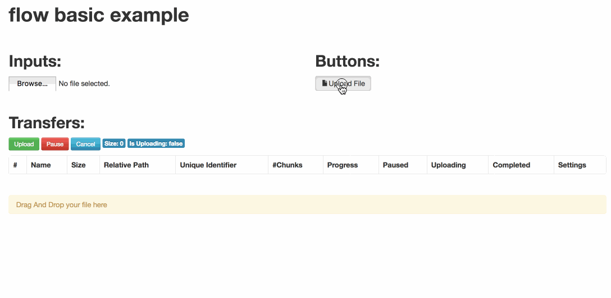

#Play NG Flow sample

Example project for setting up resumable, fault tolerant uploads using
[NG-Flow](http://flowjs.github.io/ng-flow/) and [Play Framework](https://www.playframework.com/)

## Setup

Requires [Activator](https://www.lightbend.com/activator/download) or [sbt](http://www.scala-sbt.org/download.html)

    $ sbt run
    # Or
    $ activator run

Screenshot
--------

##Credits

Heavily modified from code by [kayrnt](http://www.kayrnt.fr)

## License

[MIT](LICENSE)
